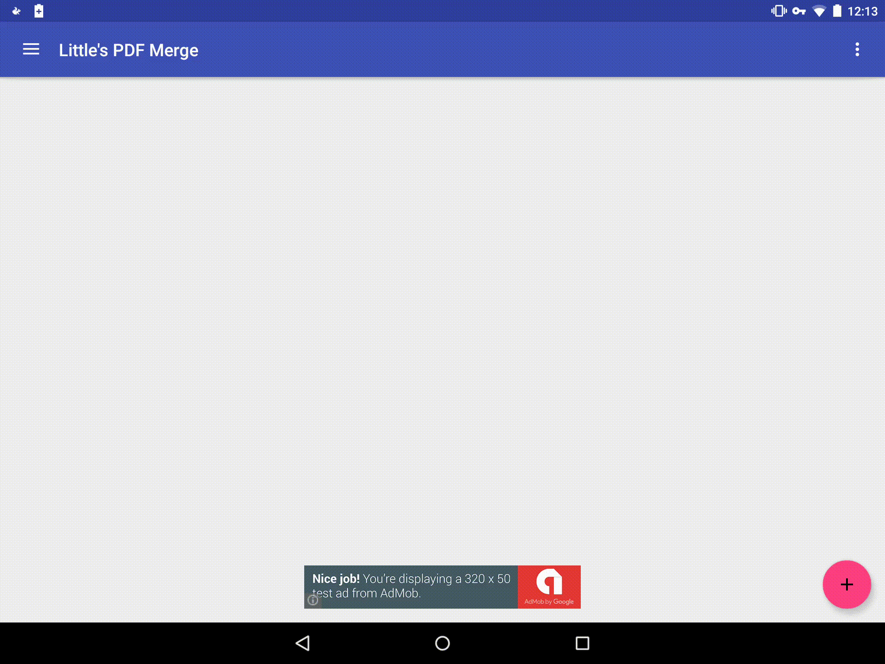

# Little's PDF Merge

Free , as fast as a running 🐕 dog ,and open source PDF merger with support for multiple platforms


Free to use, distrubute and modify 
**You can't sell this, and remove all '*SuicSoft*' stuff if you're using it **

**NO COPYING OF OUR USER INTERFACE IS ALLOWED.*
(keep the dog if you like!) - read more in [**LICENSE.md**](License.md) 
<!---Replace developer with correct branch--->
<!---Appveyor build status--->
[](https://ci.appveyor.com/project/SuicSoft/little-pdf-merge) [](https://gitter.im/SuicSoft/Little-PDF-Merge?utm_source=badge&utm_medium=badge&utm_campaign=pr-badge&utm_content=badge)
# SuicSoft. Better Software. Happier PCs
SuicSoft's great **FREEWARE** are **badware** free (free from those annoying stuff...you know)
We've got great PDF Mergers, System Speederupers and Tweakers! Just come to our website! (we don't have much traffic!)
and download the great **GOODWARE**

#Oh! And if you want to see, here's the dog we were talking about!

.png)

I'm Suici. Say that like Sooky. I'm not as popular as Android, Duo or the Octocat, But I'm on the web!
What Am I? I'm a dog, bearded collie puppy! - And I was drawn in Fresh Paint for the Logo - But I'm real!

#How to install this build
The developer (on each repo) branch is updated daily or at least a few times a week.
To install the Android version an APK will be located in ```./Release/Android/app-debug.apk``` (and ```app-release.apk``` for release) and side-load it on to your device. Little's PDF Merge will check for updates every time you open it
To install the Windows version an installer and ```LPM.ZIP``` will be located in ```./Release/Windows/setup.exe``` or ```./Release/Windows/LPM.ZIP```. Little's PDF Merge will update check for updats when you open it (except for ```LPM.EXE```

#How do I build it from the source.
It is very easy to do (tested on Elementary OS freya and Windows 10)

For Windows (open command prompt with WIN + R and type ```cmd```)
```
git clone https://github.com/suicsoft/little-pdf-merge.git
cd little-pdf-merge
build-all.bat
build-all-dbg.bat (use if you want debug builds instead of release)
```
For Linux (open terminal. Note that this will NOT build the Windows builds)
```
git clone https://github.com/suicsoft/little-pdf-merge.git
cd little-pdf-merge
./build-all.sh
./build-all-dbg.sh (use if you want debug builds instead of release)
```
